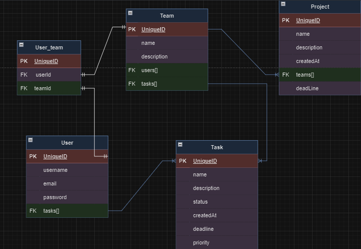

# Gestión Colaborativa de Tareas

## Introducción

En el ámbito de la gestión de tareas, la colaboración eficiente entre usuarios es esencial para optimizar la productividad y el cumplimiento de objetivos. En este contexto, surge la necesidad de desarrollar una aplicación web que facilite la gestión colaborativa de tareas, permitiendo a los usuarios trabajar de manera conjunta en la organización y seguimiento de actividades. El presente proyecto se enmarca dentro del curso de Fundamentos de la Computación Paralela y Distribuida, donde se propone la creación de una plataforma web innovadora que integre tecnologías avanzadas para ofrecer una experiencia de usuario fluida y funcional.

La aplicación busca no solo proporcionar un entorno para la gestión eficiente de tareas, sino también servir como un estudio de caso para comprender los principios fundamentales de la computación distribuida y las metodologías de desarrollo de software modernas. El objetivo principal de este proyecto es diseñar y desarrollar una aplicación web robusta y escalable que permita a los usuarios gestionar sus tareas de forma colaborativa y eficiente. Para lograr este objetivo, se plantean una serie de objetivos específicos que abarcan desde la comprensión del estado actual de las soluciones existentes hasta la implementación y validación del sistema propuesto.

## Justificación

La creación de una aplicación web para la gestión colaborativa de tareas se fundamenta en la necesidad de proporcionar a los usuarios una herramienta eficiente y flexible para organizar sus actividades diarias, especialmente en entornos de trabajo donde la colaboración y la coordinación son fundamentales para el éxito de los proyectos. A continuación, se presentan algunas razones que respaldan la pertinencia y relevancia de este proyecto:

- **Optimización de la productividad:** La gestión eficiente de tareas es esencial para aumentar la productividad individual y colectiva. Al proporcionar una plataforma que facilita la colaboración entre usuarios, se promueve una mejor distribución de responsabilidades y una mayor coordinación en la ejecución de actividades, lo que se traduce en un aumento en la eficiencia y el cumplimiento de objetivos.

- **Flexibilidad y accesibilidad:** Una aplicación web permite acceder a la plataforma desde cualquier lugar y en cualquier momento, lo que brinda a los usuarios la flexibilidad necesaria para gestionar sus tareas desde diferentes dispositivos y ubicaciones. Esta accesibilidad favorece la colaboración remota y la participación activa de todos los miembros del equipo, incluso cuando se encuentran en distintas ubicaciones geográficas.

- **Colaboración en tiempo real:** La capacidad de colaborar en tiempo real en la gestión de tareas facilita la comunicación y la toma de decisiones, ya que los usuarios pueden ver los cambios realizados por otros miembros del equipo al instante. Esto reduce la duplicación de esfuerzos y evita posibles conflictos causados por la falta de sincronización en la información.

- **Seguimiento y control:** La aplicación proporciona herramientas para realizar un seguimiento detallado del progreso de las tareas, asignar prioridades, establecer fechas límite y monitorear el cumplimiento de los objetivos. Esto permite a los usuarios tener un mayor control sobre el flujo de trabajo y tomar decisiones informadas para optimizar la distribución de recursos y la asignación de tareas.

- **Facilitación de la comunicación:** La plataforma incluirá funcionalidades para facilitar la comunicación entre los miembros del equipo, como comentarios en las tareas, notificaciones de actualizaciones y chat integrado. Estas herramientas fomentan la colaboración y el intercambio de información, promoviendo un ambiente de trabajo colaborativo y transparente.

## Objetivos

### Objetivo General
Crear una aplicación web que permita a los usuarios gestionar tareas de manera colaborativa y eficiente.

### Objetivos Específicos
1. **Comprensión y Entendimiento:** Analizar cómo otros sistemas o aplicaciones abordan la colaboración en la gestión de tareas.
2. **Selección:** Definir la arquitectura general del sistema, incluyendo la base de datos y la comunicación entre componentes.
3. **Creación:** Desarrollar el backend utilizando Spring Boot para implementar la lógica de negocio, la autenticación de usuarios, la gestión de tareas y el frontend con Angular para crear las interfaces de usuario que permitan agregar, asignar y editar tareas.
4. **Validación:** Realizar pruebas unitarias y de integración para verificar que el sistema cumple con los requisitos establecidos.

## Integrantes

Junior ivan silva
Gregorio Cardona

## universidad de pamplona ingenieria de sistemas

## Fundamentos de computacion paralela y distribuida

## MER

